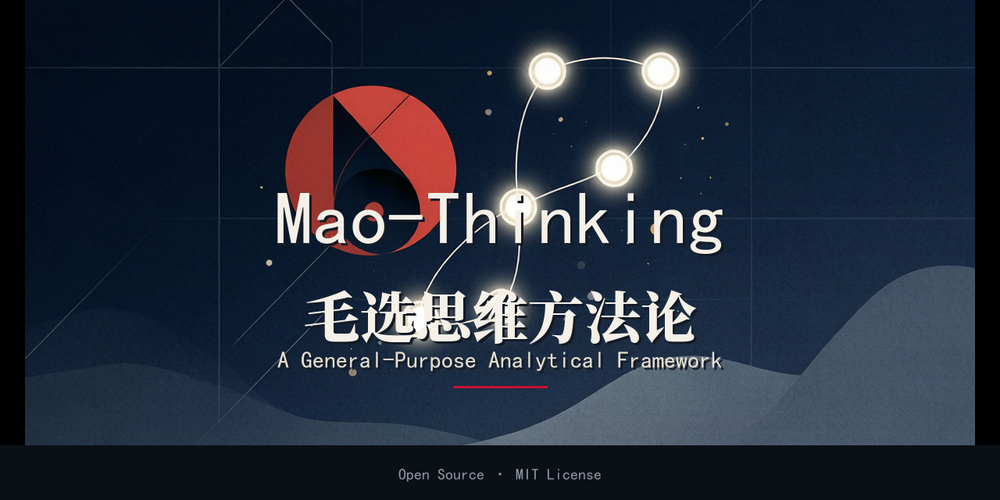

English | [中文](README.md)

# Mao-Thinking — A General-Purpose Analytical Framework

> A general-purpose analytical framework distilled from *Selected Works of Mao Zedong*, applicable to problems and decisions in **any domain**.



[](LICENSE)
[](mao-thinking.md)
[](README.en.md)
[](CHANGELOG.md)

This repository turns Mao's core thinking methods (seeking truth from facts, *On Practice*, *On Contradiction*, strategic and tactical thought) into a **procedural, callable methodology**. Once loaded as an AI's system prompt, it makes the assistant analyze complex problems the way Mao analyzed the Chinese revolution: **investigate, seize the principal contradiction, set strategy, choose tactics, execute, and review**.

It is not a history knowledge base — it is a "how to think, how to act" methodology with unlimited scope: business decisions, engineering, product planning, organizational management, interpersonal博弈 (games), strategic judgment, and personal dilemmas all fit.

---

## ✨ Features

- **General-purpose** — fits any domain, any hard problem, no industry lock-in.
- **Procedural** — a five-link chain + 8-step workflow + 21 thinking models force structured output.
- **De-branded** — pure Markdown, not tied to any AI platform; paste and use.
- **Cross-tool** — ships as a universal paste version, a Claude/WorkBuddy `SKILL.md`, and OpenAI custom-GPT instructions.
- **Auditable** — every judgment must state its basis and separate fact from opinion.

---

## 📂 Repository Structure

```
mao-thinking/
├── mao-thinking.md          # Universal paste version (core, single self-contained file)
├── SKILL.md                 # Claude Skills / WorkBuddy compatible (name/description header)
├── gpt-instructions.md      # OpenAI custom GPT Instructions text
├── README.md                # Chinese README
├── README.en.md             # This file (English README)
├── LICENSE                  # MIT
├── CHANGELOG.md             # Version history (target of the "updated" badge)
├── assets/
│   └── cover.png            # GitHub repository social preview (1280×640)
├── references/
│   ├── models.md            # Full breakdown of the 21 thinking models
│   └── applications.md      # Applied-article highlights (burnout, sectarianism, open strategy…)
└── examples/
    ├── example-独立开发者决策.md        # Test: solo-dev "quit job or not" decision
    ├── example-产品规划-功能优先级.md    # Test: product planning / feature priority
    ├── example-人际博弈-跨部门谈判.md    # Test: interpersonal game / cross-team negotiation
    ├── example-技术战略-技术债重构.md    # Test: tech strategy / tech-debt vs rebuild
    └── examples.en.md         # English summary of all 4 examples (overseas entry point)
```

---

## 🚀 Quick Start

### Method 1: Universal paste version (recommended)

1. Open [`mao-thinking.md`](mao-thinking.md) and copy the whole file.
2. Paste it into **any AI tool's system prompt / project instructions / custom instructions**:
   - **ChatGPT**: Settings → Custom instructions, or a Project's "Project instructions"
   - **Claude**: a Project's "Project knowledge" or custom system prompt
   - **Cursor / Windsurf / Cline**: `CLAUDE.md` / `.cursorrules` / `rules` at project root
   - **Gemini**: Extensions → "Saved info" or Gemini Advanced custom instructions
   - any conversational AI that supports a system prompt

### Method 2: Claude Skills / WorkBuddy

- **Claude**: reference this repo as a skill directory, or place [`SKILL.md`](SKILL.md) into your skills directory (Anthropic spec uses `name`/`description` headers; this file is compatible).
- **WorkBuddy**: place `SKILL.md` plus `references/` into `~/.workbuddy/skills/mao-thinking/`.

### Method 3: OpenAI custom GPT

1. In GPT Builder's **Instructions**, paste the contents of [`gpt-instructions.md`](gpt-instructions.md).
2. In **Knowledge**, upload [`mao-thinking.md`](mao-thinking.md) (full model details for on-demand retrieval).
3. Recommended: disable web browsing to keep the methodology's口径 consistent.

### Method 4: Local / open-source project

```bash
git clone <this repo>
# drop mao-thinking.md into your project's docs/ or as part of AGENTS.md
# or read it from an agent script to inject into context
```

---

## 🖼 GitHub Social Preview

The repository cover is [`assets/cover.png`](assets/cover.png) (1280×640).

Upload it under **Settings → General → Social preview** so it appears when the repo link is shared on Twitter/X, LinkedIn, WeChat, etc.

---

## 🧭 Core Framework

| Component | Content |
|-----------|---------|
| **Five-link chain** | Fact → Thought → Plan → Action → Result (seek truth from facts) |
| **Three philosophical foundations** | *On Practice* · *On Contradiction* · Subject–object unity |
| **8-step workflow** | Investigate → List contradictions → Seize principal contradiction → Analyze its principal aspect → Subject–object check → Set strategy → Choose tactics → Factorize + review |
| **21 thinking models** | Seeking truth / Investigation, Practice loop, Contradiction law, Play the piano, Concentrate superior forces, Dialectical processing, Overall coordination, Whole commands part, Know your numbers, Seize initiative, Sense→reason leap, Summarize experience, Create converting conditions, Flexible maneuver, Foresight & phasing, Mass line, Subject–object unity, Quantitative→qualitative, General & particular, Factorization, and more |

Standard output template (recommended for complex problems):

```
【Objective Facts】 — current situation, known facts, what needs verification
【Contradiction List】 — list the main conflicts
【Principal Contradiction】 — which one, if unsolved, blocks everything else
【Principal Aspect】 — the side that decides the nature / converting condition
【Subject–Object Check】 — reality vs expectation, correct the deviation
【Strategy】 — holistic judgment, phase, focus
【Tactics】 — which thinking models to apply
【Action Breakdown】 — factorize into daily executable tasks
【Review Mechanism】 — how to test and iterate
```

---

## 📝 Usage Examples

Full tests live in [`examples/`](examples/). Three domains are covered:

- **Personal/career** — [should a solo developer go all-in?](examples/example-独立开发者决策.md)
- **Product planning** — [build B-side or deepen C-side? feature priority](examples/example-产品规划-功能优先级.md)
- **Interpersonal game** — [negotiating headcount with a dominant VP](examples/example-人际博弈-跨部门谈判.md)
- **Tech strategy** — [tech debt vs rewrite](examples/example-技术战略-技术债重构.md)

🌐 **Non-Chinese readers:** see [`examples/examples.en.md`](examples/examples.en.md) — a condensed English summary of all four cases (question → principal contradiction → strategy → takeaway) that proves the framework works cross-domain without reading the Chinese sources.

📌 Version history is in [`CHANGELOG.md`](CHANGELOG.md).

Short demo:

> **Q**: The team keeps working inefficient overtime — where's the problem?
> **Framework A**: Seize the principal contradiction — most overtime is rework for "rough, hasty, unprepared early decisions." Fix: use investigation + principal-contradiction analysis *before* deciding, to cut "patchwork overtime." This is a decision problem, not an execution problem.

---

## 🎭 Custom Persona

The methodology carries no fixed persona. The "advisor-style output spec" at the end of [`mao-thinking.md`](mao-thinking.md) lets you rename "advisor" to whatever assistant name you like (e.g., "Advisor Wang").

---

## 🤝 Contributing

Issues / PRs welcome: add thinking models, fix historical cases, add multilingual versions, or more cross-tool adapters. Please state the basis of your change (fact / contradiction analysis / historical analogy).

---

## 📄 License

[MIT](LICENSE) — free to use, modify, and redistribute; keep attribution.

> Disclaimer: This methodology is distilled from the *thinking methods* of publicly available works, intended to aid reasoning and decision-making. It is **not** investment, legal, or medical advice.
